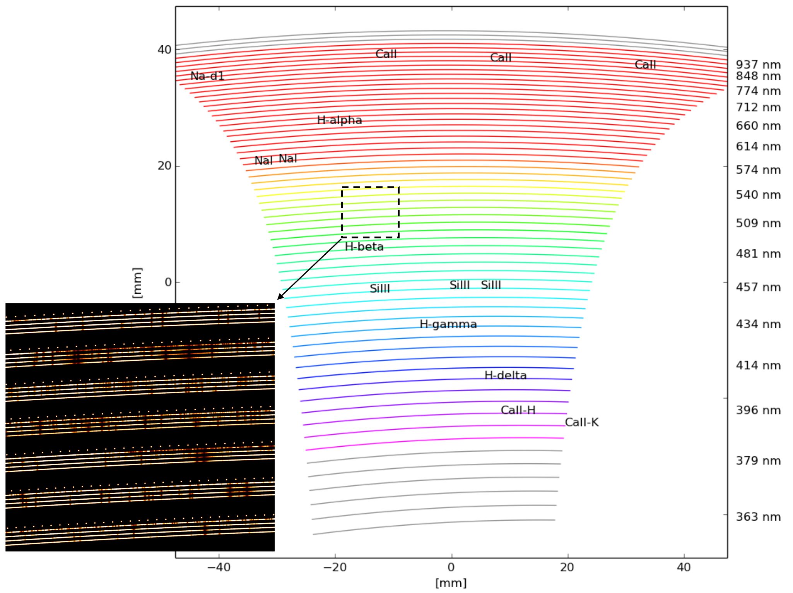

Overview
========

This documentation is an easy guide how to sucessfully generate realistic MARVEL data products. The simulations are build from two popular main modules named `PyEchelle <https://stuermer.gitlab.io/pyechelle/index.html>`_ and `Pyxel <https://esa.gitlab.io/pyxel/>`_. `PyEchelle <https://stuermer.gitlab.io/pyechelle/index.html>`_ is a Python based fast generic spectrum simulator that is used to generate each object or calibration spectrum, whereas `Pyxel <https://esa.gitlab.io/pyxel/>`_ is a general imaging detector simulation framework in Python that is used to efficiently add-on all necessary CCDs effects.
	 

	   
   This figure (with curtesy of this `paper <https://arxiv.org/pdf/2012.08121.pdf>`_) outlines the echelle spectrum of the MARVEL spectrograph for a potential object spectrum fed to fiber 2-5 and with Etalon fed to fiber 1. 

.. raw:: html

   

   
More information
----------------

Full list of PyEchelle resources:
  - `PyEchelle's documentation <https://stuermer.gitlab.io/pyechelle/index.html>`_
  - `PyEchelle's GitLab repository <https://gitlab.com/Stuermer/pyechelle>`_
  - `PyEchelle's precusor's publication (Echelle++) <https://iopscience.iop.org/article/10.1088/1538-3873/aaec2e/pdf>`_

Full list of Pyxel resources:
  - `Pyxel's Documentation <https://esa.gitlab.io/pyxel/>`_
  - `Pyxel's Simulator GitLab repository <https://gitlab.com/esa/pyxel>`_
  - `Pyxel's Data-example GitLab repository <https://gitlab.com/esa/pyxel-data>`_
  - `Pyxel's Gitter helpdesk community <https://gitter.im/pyxel-framework/community>`_

