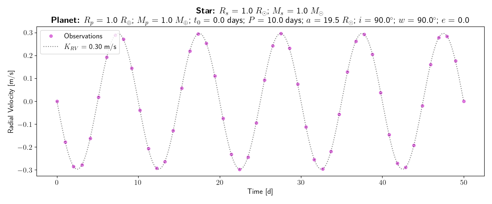
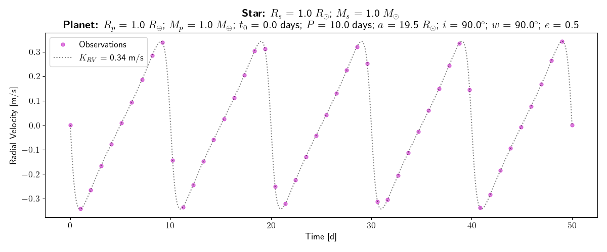
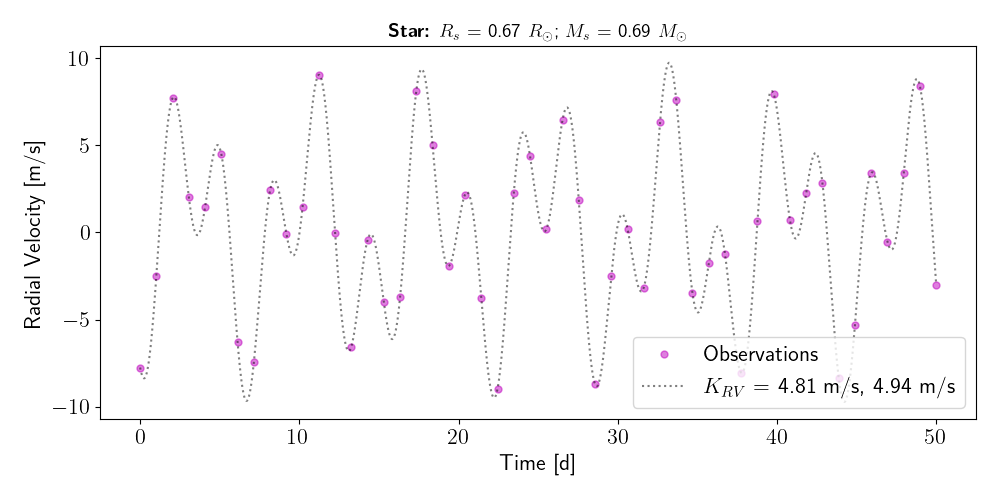

Tutorial
========

At the root of the MARVELsim repository two scripts called ``simulator-marvel.py`` and ``rv-generator.py`` are made availble for the user. The former is the main script we will use to simulate the MARVEL spectra. We will in the following distinguish between the usage of the **science mode** and **calibration mode** of this software. Intuitively the science mode should be used when simulating a Radial Velocity (RV) time series for which a cross-dispersion displacement in the simulated spectra is generated by the presence of an exoplanet orbiting its stellar host. We will ellaborate on how to perform such simulations in the following, but notice that the ``rv-generator.py`` is a small generic script to generate the RV time series as input for ``simulator-marvel.py``. The calibration mode of ``simulator-marvel.py`` is what also is referred to the *afternoon calibrations* as these calibrated spectral images are usuaally conducted during the afternoon prior to the nightly observations. We start explaining the generation of calibration spectra, then object spectra, and lastly how to use PyEchelle and Pyxel independently.

Calibration mode
----------------

The script ``simulator-marvel.py`` makes it very easy to produce a batch of calibration data similar to what in the future will be produced in afternoon, so-called afternoon calibration data. A dataset calibration data consist of

  - 10 bias images
  - 5 spectral flats (fiber 1-5)
  - 5 ThAr arc spectra (fiber 1-5)
  - 5 ThNe arc spectra (fiber 1-5)
  - 5 Etalon (fiber 1) + ThAr (fiber 2-5)

To acquire an overview of the module simply use:

.. code-block:: shell

   python simulator.py -h

The calibrated data are simply generated by adding the calibration flag and parsing the ourput directory to the simulator as follows: 

.. code-block:: shell

   python simulator-marvel.py --calibs -o </path/to/output/>

   
Science mode
------------

Like the calibration mode of ``simulator-marvel.py`` the science mode also very user frindly. In following we show two usage examples (also promt by using the built-in help function) simulating a single spectrum of a Sun-like star, with and without a RV signal:

.. code-block:: shell

   python simulator-marvel.py --time 300 --mag 10.0 --teff 5800 --logg 4.5 --z 0.0 -o </path/to/outdir>
   python simulator-marvel.py --time 300 --mag 10.0 --teff 5800 --logg 4.5 --z 0.0 --rv 5.5 -o </path/to/outdir> 

Notice that it is also possible to simulate up to four different targets in each of the fibers 2-5. For more examples on how this works see section of :ref:`extra examples <extra examples>`.

RV time series
--------------
   
Within the base of the MARVELsim repository a script exists to generate noise-less RV amplitude time series. Again to get an overview of the parsed arguments simply type:

.. code-block:: shell

   python rv-generator.py -h

This small utility explores the python library `RadVel <https://radvel.readthedocs.io/en/latest/>`_ for calculating the true anomaly for a given set of input time point over the observed duration. The modelling of the RV time series are then calculated using the expression for the observed RV signal (Eq. 65) given by `Murray & Correria (2010) <https://arxiv.org/pdf/1009.1738.pdf>`_. To be seen in the figure below, we here show an example of generating the RV time series for a single Earth-like planet with a short circular and eccentric orbital period, respectively:  

.. code-block:: shell

   python rv-generator.py -tdur 50 -rs 1 -ms 1 -rp 1 -mp 1 -t0 0 -p 10 -i 90 -w 90 -e 0.0
   python rv-generator.py -tdur 50 -rs 1 -ms 1 -rp 1 -mp 1 -t0 0 -p 10 -i 90 -w 90 -e 0.5

.. note::

   Notice that the current version of ``rv-generator.py`` simply schedule an observation for each consecutive night. The the future it should be possible to select the observational compaign through tighter constraints.
	   
The script can also create models of multi-planet systems. As an example we here show how to model the K6V spectral type star `TOI-1260 <https://academic.oup.com/mnras/article-abstract/505/4/4684/6280967>`_ hosting two (transiting) mini-Neptunes on (assumed) circular orbits:

.. code-block:: shell

   python rv-generator.py -tdur 50 -rs 0.67 -ms 0.69 -rp 2.33 2.82 -mp 8.6 11.8 -t0 10 20 -p 3.13 7.49 -i 90 90 -w 0 90 -e 0 0

   
.. warning::

   Be warned that the current multi-planet model is very simplistic and do not take into account of the gravitational interactions between the planets. Indeed such interactions perturbes the reflex motion of the stellar host.
